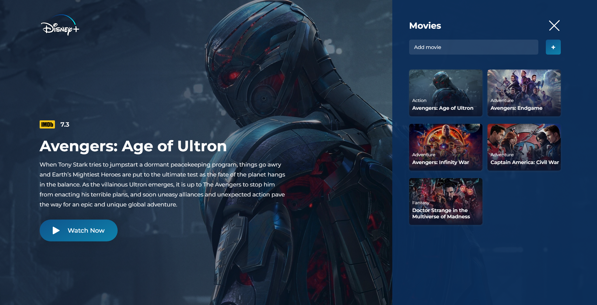
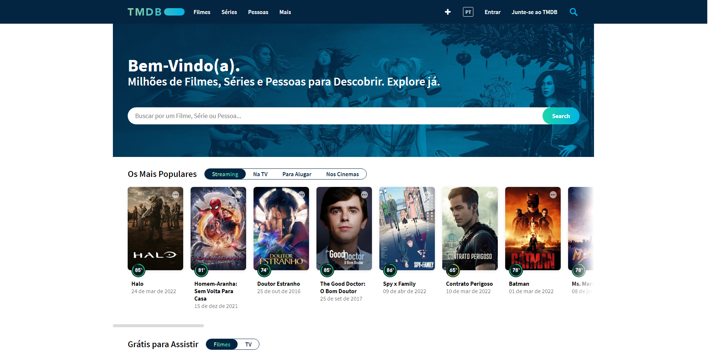

# Disney+ UI Clone



Um pequeno projeto de design do Disney+, desenvolvido em
ReactJS utilizando Styled-Components.

Este projeto foi baseado no canal do Leo Vargas no Youtube

[Canal do Leo Vargas](https://www.youtube.com/c/LeoVargas)

#

# Bibliotecas utilizadas

- [Styled-Components](https://styled-components.com/) (Estilizações)
- [Axios](https://axios-http.com/ptbr/docs/intro) (Requisições api)

# Instalação

Para utilizar este projeto, abra seu terminal e digite

```bash
npm install
```

ou se preferir, utilize o

```bash
yarn install
```

# Utilização de Api



- Este projeto utiliza a api do TheMovieDB, para utilizar, você deve cadastrar uma conta no site - [Clicando no link](https://www.themoviedb.org/signup)

- após fazer o cadastro e em seguida fazer o login, clique no seu usuário, depois em configurações, API e copie a "Chave da API (v3 Auth)"

- Fazendo isso, entre no projeto e na raíz do diretório crie um arquivo .env e nele coloque

```bash
 REACT_APP_API_KEY='SUA_CHAVE_API'
```

- Depois de completar estes passos, digite

```bash
npm start
```

ou

```bash
yarn start
```

E divirta-se! 😀
